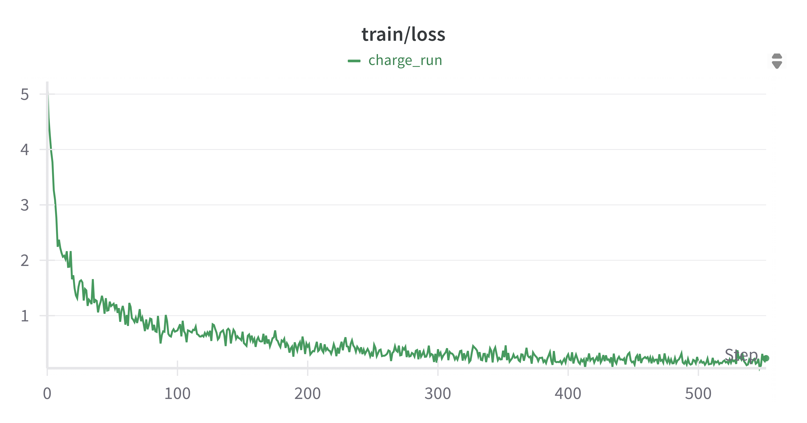
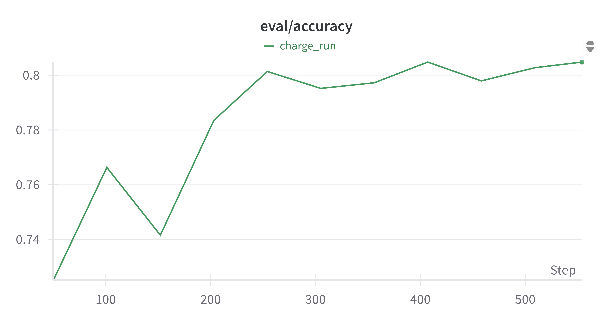
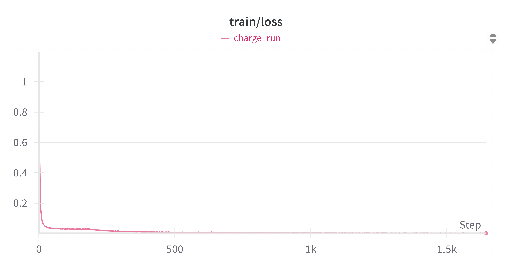
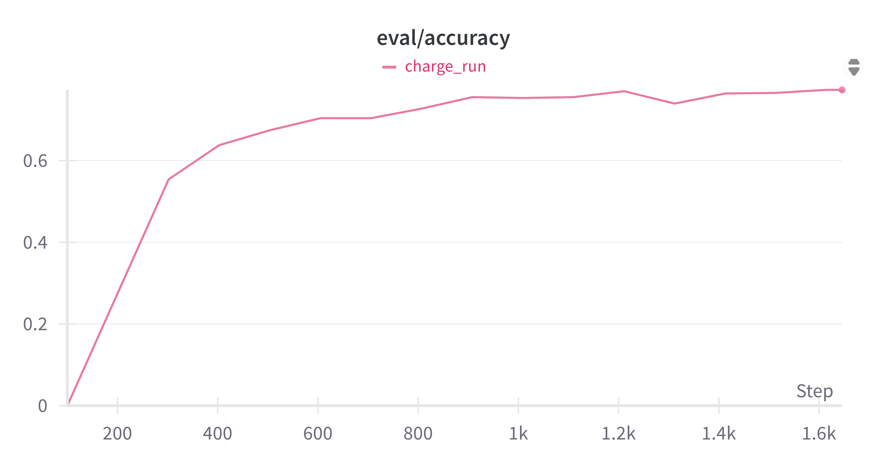
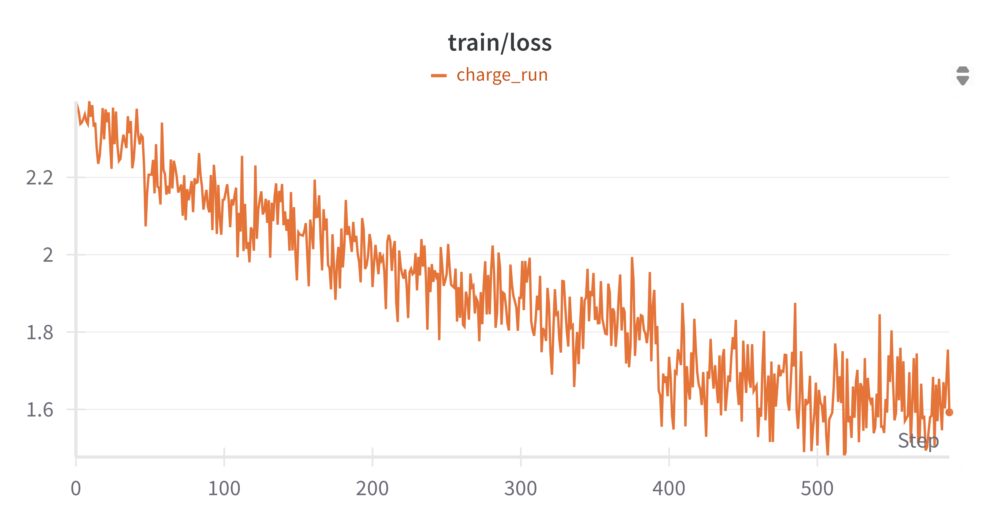
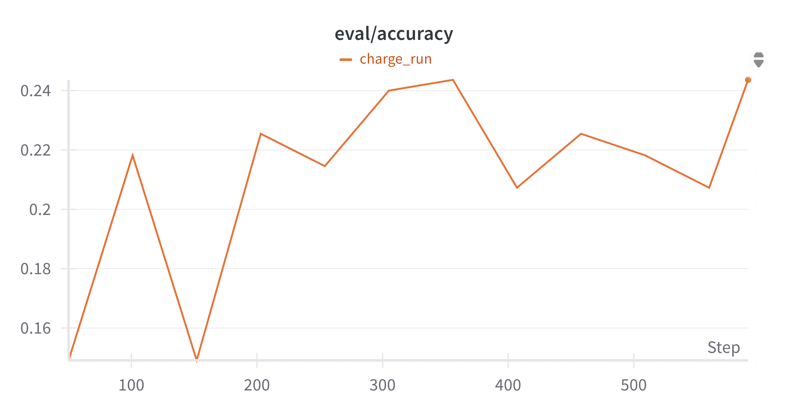

[toc]

# 自然语言处理基础——多被告法律判决预测

以下是我第四次作业的报告，本次作业我选择的是第二个任务，即多被告法律判决预测。我们主要的方案是：

1. 使用预训练的语言模型微调进行文本分类，将不同的被告名称信息以提示词的方式加入到输入文本中，让预训练的语言模型自己提取不同被告的区别和联系
2. 罪名预测使用单标签分类，基于对数据分布的统计，忽略多个罪名的可能，近似为单标签分类
3. 罪名预测也支持多标签分类，通过将多标签分类转化为每个标签的二分类来设计损失函数计算、模型推理和评估指标计算，实现多标签分类
3. 刑期预测通过区间转化将回归任务转化为分类任务，简化了任务，也缓解了数据分布不均衡的问题

## 罪名预测

这一任务中，我们需要根据输入的案件事实，判断每名被告的罪名，这是一个很明显的文本分类任务，我们也确实是按照文本分类任务来做的。我们训练了一个文本分类器，接受处理后的数据（包含被告名字和案件事实的文本），输出罪名标签，映射到罪名以实现罪名预测。

### 数据分析和处理

我们分析了数据的分布，发现教学网上的数据存在以下几个明显的特点：

1. 数据类别分布不均衡，训练数据中一共有30429名被告，321个罪名标签，但最多的5个标签即有15652名被告，10个标签即有20690名被告，数据类别分布不均衡
2. 同一案件中不同被告罪名多是相同
3. 一名被告多只有一个罪名成立

依照这些发现，我们对数据做了这些处理：

1. 尽管多数案件所有被告罪名都是一样的，但我们还是针对每个被告单独预测罪名，因此，我们在输入的案件事实之前标注了被告人，即加上了前缀 `【当前被告人：<被告人名称>】，` ，用以帮助模型区别不同之被告。
2. 多数被告仅有一条罪名成立，因此我们设计了单标签分类任务，即即使一个数据中被告有多条罪名，我们也仅选择一条，作为多标签分类的baseline和对照。
3. 除了单标签分类任务，我们还是进行多标签分类，并与单标签分类任务进行对照。
4. 我们在训练中尝试因应不均衡的类别分布设计类权重调整，因此统计了不同类别的频率。

数据处理相关的代码悉数在[data_formatter.py](./src/finetune/data/data_formatter.py)中。

### 模型训练

正如上面所说，我们同时训练单标签分类和多标签分类，这两个的区别主要在于数据的格式和损失函数、评估度量上，而其他大多数过程是相同的，因此我们将其实现在了同一个训练器中，而仅依靠配置文件的不同加以区别，具体的代码在[normal.py](./src/finetune/trainer/normal.py)，相关的配置文件在[charge.yaml](./configs/finetune/charge.yaml)和[multi_charge.yaml](./configs/finetune/multi_charge.yaml)。

#### 单标签分类

我们的分类器的基本结构是一个预训练的Transformer架构模型加上一个分类头，这里我们直接使用 `transformers` 库为我们定义的 `AutoModelForSequenceClassification` ，底层的预训练模型我们尝试了[bert-base-chinese](https://huggingface.co/google-bert/bert-base-chinese)和[Lawformer](https://huggingface.co/thunlp/Lawformer)，二者的实验结果是差不多的。

训练中我们选择了500条数据作为评估数据集，其他的作为训练集。

训练过程中，我们使用 `transformers` 库的 `Trainer` 默认的损失函数计算方法——标签平滑损失，但我们没有设置平滑因子，所以实际上也是交叉熵损失。

我们使用9500条数据（每条数据包含多名被告，因此总共用于训练的数据并非这个数字），按照配置文件[charge.yaml](./configs/finetune/charge.yaml)中的配置进行训练，得到的训练的损失曲线如下图所示：



评估准确率曲线图如下图所示：



完整的训练结果如下：

```json
{
  "_runtime": 3046.272205733,
  "_step": 554,
  "_timestamp": 1750777407.1900203,
  "eval/accuracy": 0.8048109965635739,
  "eval/loss": 0.9482763409614564,
  "eval/macro_f1": 0.5300131112450627,
  "eval/micro_f1": 0.8048109965635739,
  "eval/runtime": 27.0623,
  "eval/samples_per_second": 53.765,
  "eval/steps_per_second": 6.725,
  "eval/weighted_f1": 0.7936482929085698,
  "total_flos": 28612931912497150,
  "train/epoch": 3,
  "train/global_step": 5433,
  "train/grad_norm": 6.734439373016357,
  "train/learning_rate": 7.362414872078043e-8,
  "train/loss": 0.2315,
  "train_loss": 0.5315539495580306,
  "train_runtime": 3019.4294,
  "train_samples_per_second": 28.788,
  "train_steps_per_second": 1.799
}
```

可以看到模型经过微调后罪名预测能力得到了显著的提升，在Kaggle平台取得的分数为 $0.85446$ 。

#### 多标签分类

尽管单标签分类取得了不错的效果，但终究是对数据做了近似的考量，如果应用于多罪名的预测任务中，则会毫无疑问的取得难以令人满意的效果，因此我们另外进行了多标签分类模型的训练。

我们使用与上面相同的Lawformer作为微调的模型，使用多标签分类的任务类型以实现多标签分类。相比于单标签分类，我们在以下的几个方面做了修改：

1. 输入标签：单标签分类任务的输入的标签中是真实标签，即罪名的编号，多分类任务中，我们可能有多个的罪名，因此我们的输入标签是一个向量，它的长度与类别的总数相等，所有的元素都为0，除了罪名成立的编号索引上的元素为1。
2. 损失函数：这里我们的损失函数没有继续使用Trainer默认的标签平滑损失，而是使用BCE损失，这是因为我们推理的方式发生了变化，我们不再是选择最大的logits的索引为我们预测的标签，而是对logits求sigmoid得到概率，凡是大于1/2的视为成立的罪名，事实上即对每个罪名的二分类，因此我们使用的是对应的二元交叉熵损失，即BCE损失。
3. 评估度量：评估度量就总体上而言还是准确率、精确度、召回率和F1分数，但具体实现上我们因应任务的调整做了调整，主要是精确度、召回率和F1分数的平均方式从weighted变为了samples。

采用配置文件[multi_charge.yaml](./configs/finetune/multi_charge.yaml)中的配置进行训练，训练的损失函数如下图所示



评估的准确率曲线如下图所示：



完整的训练结果如下所示：

```json
{
  "_runtime": 8925.678572175,
  "_step": 1646,
  "_timestamp": 1750857067.809987,
  "eval/accuracy": 0.7731958762886598,
  "eval/f1": 0.7929340533464245,
  "eval/loss": 0.004790003411471844,
  "eval/precision": 0.7955326460481099,
  "eval/recall": 0.7956471935853379,
  "eval/runtime": 27.4661,
  "eval/samples_per_second": 52.974,
  "eval/steps_per_second": 6.626,
  "total_flos": 85838795737491460,
  "train/epoch": 9,
  "train/global_step": 16299,
  "train/grad_norm": 0.003027814906090498,
  "train/learning_rate": 3.6812074360390214e-8,
  "train/loss": 0.0016,
  "train_loss": 0.011544441446365737,
  "train_runtime": 8898.4307,
  "train_samples_per_second": 29.305,
  "train_steps_per_second": 1.832
}
```

可以看出我们的训练确实取得了较好的效果，在Kaggle平台取得的分数为 $0.73036$ 。

### 模型推理

模型推理的代码主要在 `src.predictor.charge_predictor` 包中，单标签分类模型的推理代码主要在[lawformer.py](./src/predictor/charge_predictor/multiple_predictor/lawformer.py)中，但其中不是简单的输出logits最高的索引，而是选择最高的若干个索引，这主要是为了支持我们尝试的另一个方案（即[大模型选择校正](#大模型选择校正)，尽管没有成功），多标签分类模型的推理代码主要在[multi_label.py](./src/predictor/charge_predictor/multi_label.py)中，其核心在于将多标签分类任务等同于一个每个标签的二分类任务，从而用sigmoid计算概率，凡概率大于0.5的则为成立的罪名。

我们的实验中，罪名预测与刑期预测是相结合的，这主要是考虑刑期与罪名是高度绑定的，但为了能单独的预测罪名，我们提供了一个全零刑期预测的实现。

### 小结

罪名预测中，我们主要实现了两个方案，一个是单标签预测，一个多标签预测，结果表明，多标签预测尽管更为接近真实的数据情况，具备处理多个罪名的数据的能力，但其训练更为困难，最终的效果不如单标签预测的效果。最终我们的实验结果采纳的是单标签预测的结果，Kaggle平台上取得的分数为 $0.85446$ 。

## 刑期预测

这一任务中，我们需要根据案件事实的描述和预测的罪名，确定被告的罪名对应的有期徒刑刑期。刑期通常是一个确定的数字，刑期预测根本上应该是一个回归任务，但考虑到实际情况，我们还是将其转化为分类任务，因为当前大多数的人工智能辅助判案系统，都是给出一个刑期，但同时也会允许用户（通常是法院工作人员）在一定范围内调整，一方面是判案系统不一定准确，另一方面可能有一些特殊的实际情况不为判案系统所掌握，需要法院工作人员另外调整。因此，我们认为，将刑期预测为一个区间是一个更符合实际判案流程的操作，因此我们以区间为标签，将刑期预测任务转化为了分类任务。

### 数据分析和处理

我们分析了训练数据的分布，注意到训练数据分布很不均衡，短刑期占比很大，一年以内的刑期占比接近1/3，半年的倍数的刑期占比很大，这是比较符合生活实际的。我们注意到量刑与罪名是高度相关的，所以我们除了在数据的案件事实描述前加上被告的名称，还加入了罪名的信息，即添加的前缀是 `【当前被告人：<被告人名称>】，【罪名：<罪名>】` 。对于刑期区间地划分，我们充分考虑了训练数据中刑期的分布，主要确保两点：

1. 不同区间内的被告数目尽量均衡，这是为了分类任务的训练的容易和稳定。
2. 一个区间内的被告尽量集中在一个刑期上，这是因为我们最后预测出标签后还需要将标签映射回刑期，通常采用的是映射到这个区间出现最多的刑期上，区间内的被告刑期主要分布在一个刑期上，有助于提高映射回去的准确率。这一定程度上也是利用了刑期分布的不均衡性。

我们划分刑期为如下的区间：

$$
[0, 6), [6, 7), [7, 8), [8, 9), [9, 10), [10, 12), [12, 18), [18, 25), [25, 35), [35, 61), [61, 135), [135, \infty )
$$

这样的区间划分有以下的几个好处：

1. 将回归任务转化为了分类任务，使得训练更为容易、稳定
2. 更符合法律工作者确定刑期的实际流程，一般情况下法律条文中对刑期的规定都是一个区间或者说上下界，而鲜有规定具体的刑期数字的
3. 一定程度上缓解了分布不均衡的问题，如果没有划分区间，会有很多的类别或刑期只有个位数甚至没有被告，造成训练的困难，而我们的区间划分方式则是考虑了这一因素，尽量的确保不同标签数据分布的均衡性。

刑期与标签的映射主要在[imprisonment_mapper.py](./src/utils/imprisonment_mapper.py)中实现。

### 模型训练

由于我们将刑期预测任务转化为了分类任务，所以这里的训练流程与之前罪名预测是几乎一样的，所以我们使用的是同一个训练器，其区别仅仅在于数据集转化的不同，代码在[normal.py](./src/finetune/trainer/normal.py)，相关的配置在[imprisonment.yaml](./configs/finetune/imprisonment.yaml)，训练损失曲线如下图所示



评估准确率曲线如下图所示



完整的训练结果如下所示：

```json
{
  "_runtime": 5778.005526346,
  "_step": 591,
  "_timestamp": 1750784284.1428025,
  "eval/accuracy": 0.2436363636363636,
  "eval/loss": 2.123399257659912,
  "eval/macro_f1": 0.15787421688042805,
  "eval/micro_f1": 0.2436363636363636,
  "eval/runtime": 6.9804,
  "eval/samples_per_second": 39.396,
  "eval/steps_per_second": 5.014,
  "eval/weighted_f1": 0.18158767008478308,
  "total_flos": 30425584452673536,
  "train/epoch": 3,
  "train/global_step": 5790,
  "train/grad_norm": 10.105371475219728,
  "train/learning_rate": 8.635578583765111e-9,
  "train/loss": 1.5924,
  "train_loss": 1.896471021253622,
  "train_runtime": 5771.2407,
  "train_samples_per_second": 16.051,
  "train_steps_per_second": 1.003
}
```

经过参数调整，我们在Kaggle平台取得的最高分数为 $0.20300$ 。

### 模型推理

模型推理的代码实现与之前罪名预测是类似的，不同之处在于

1. 罪名需要依赖之前的预测，而无法从数据中直接获取
2. 推理得到标签后需要映射回刑期数字，我们采取的是映射回占比最大的刑期

相关的代码主要在[lawformer.py](./src/predictor/imprisonment_predictor/lawformer.py)中。

我们也将我们的结果与一些baseline进行了比较，如果全部预测刑期为 $0$ ，Kaggle平台的分数是 $0.17003$ ，如果每个罪名预测训练集中频率最高的刑期数字，Kaggle平台的分数是 $0.16785$ ，我们的分类器的分数为 $0.20300$ ，因此，我们认为，尽管这个分数比较低，但很大程度上是任务本身比较困难，我们的分类器确实是在训练中学习到了一些分类的方法的。

## 其他的尝试

除了上面的使用预训练语言模型微调分类器的方案，我们也尝试了其他的方案，但普遍没有取得比分类器更好的效果，这里简单介绍这些尝试。

### 多任务同时学习

考虑到罪名和刑期之间的关系十分密切，在之前的方案中我们只是在刑期预测中利用之前罪名预测的结果，但这样的问题是如果罪名预测失败，刑期预测理论上是不可能成功的，即使成功，其预测的逻辑是不对的。因此我们尝试实现了罪名和刑期的联合预测，它的核心要义在于模型同时预测罪名和刑期，并同时计算两者的损失，将其加和，作为总的损失，即：

$$
L_{total} = L_{charge} + \alpha L_{imprisonment}
$$

其中罪名的预测与此前类似，将预训练语言模型最后一层的输出经过一个线性分类器得到logtis进行预测，而刑期的预测则有所不同，它以预训练语言模型最后一层的输出和罪名预测的logits拼接作为输入，经过一个线性分类器进行预测。我们认为，这样做的好处有：

1. 刑期预测使用了罪名预测的logits，这样刑期预测的损失也会反向传播到罪名的预测，从而可以调整罪名，使得罪名预测事实上可以利用刑期信息的提示，而不是刑期单方向的利用罪名预测的结果
2. 训练更加高效，微调的时候罪名和刑期预测共用一个相同的预训练语言模型，我们只需要进行一次微调，而不是两个任务分别进行微调
3. 推理更加高效，这也是显然的，因为我们是联合预测罪名和刑期而不是分别预测罪名和刑期

但实际的实验中，我们发现这个方案存在两个问题：

1. 两个任务的权衡难以把握。训练中我们发现罪名的预测准确率能达到0.82左右，但刑期预测则几乎没有学习到任何的信息，这可能是我们权重的设置不合适，也可能是我们直接将logits和预训练语言模型的输出进行拼接方式不当。
2. 共享参数也导致了学习困难。两个任务共享了同一个预训练语言模型，一方面提高了训练和推理的效率，但同时也给模型的学习带来了困难，模型需要同时学会文本中关于罪名和刑期的特征，这是比较困难的。

经过实验和分析，我们认为这个方案没有取得比分别用分类器进行预测的方案更好的效果。

相关的代码实现主要在[legal_prediction_model.py](./src/finetune/model/legal_prediction_model.py)、[legal_trainer.py](./src/finetune/trainer/hf_trainer/legal_trainer.py)和[malti_task.py](./src/finetune/trainer/multi_task.py)中。

### 零样本学习

我们尝试了使用大语言模型的已有知识，通过设计合适的提示词让模型直接预测罪名和刑期，相关的代码在[llm.py](./src/predictor/llm.py)和[zero_shot.py](./src/predictor/zero_shot.py)。

我们设计的提示词是

```py
f"""你是一个中华人民共和国的法官，你现在需要根据检察院对多名被告的指控，依据中华人民共和国刑法，判断每个被告犯下的所有罪名，并给出每个罪名的量刑，量刑以月为单位。进行判决的时候，你应该注意：
1. 你要完整、仔细的阅读检察官的指控，你的量刑必须严格的按照检察官的指控事实作出，不能脱离事实，也不必怀疑检察官的指控
2. 你应该按照中华人民共和国刑法的法律条款判决，每个被告的罪名都必须在刑法中有所对应，比如“伪证罪”
3. 所有罪名都必须在指控中有明显的直接体现，不能通过主观臆断推定
4. 每个罪名的量刑必须在中华人民共和国刑法的规定范围内，必须严格的按照法律条款来量刑
5. 你需要给出每个罪名的量刑，量刑以月为单位，量刑需要是整数，注意你需要给出完整的判决，包括有期徒刑、罚金等等，但最终的总结中你只需要给出有期徒刑的量刑，其他的刑罚不必考虑，如果不必判处有期徒刑（这是很可能的），则量刑为0
6. 特别注意被告犯下罪行的时间，如果对应的法律条款后续有修改，要遵从从旧兼从轻的原则
7. 不同被告可能会有不同的罪名，一个罪行不一定所有被告都会涉及，同时即使同一个罪名不同的被告也可能会有不同的量刑，你需要逐一分析，不能一概而论
8. 你的所有罪名都必须是完整的罪名，不能使用缩写或简称
以下是检察官的指控：
{fact}
以下是被告的名单：
{', '.join(defendants)}
请你根据以上信息，给出每个被告的罪名和量刑，在此之前你应该进行详细的分析，对每一个被告要分析指控中他涉及的部分，注意被告可能同时被指控多项罪行，然后分析他可能涉及的罪名，并注意要引用中华人民共和国刑法的法律条文，然后按照《关于常见犯罪的量刑指导意见（试行）》对他的每一条成立的罪名根据罪行和法律条文分析量刑，最后使用JSON格式对之前的分析进行总结，一个示例如下：
{{"outcomes": [{{"name": "第一个被告姓名", "judgment": [{{"standard_accusation": "第一个被告第一个罪名", "imprisonment": <对应的刑期，使用整数>}}, {{"standard_accusation": "第一个被告的第二个罪名", "imprisonment": <对应的刑期，使用整数>}}]}}, {{"name": "第二个被告", "judgment": [{{"standard_accusation": "第二个被告的第一个罪名", "imprisonment": "<对应的刑期，使用整数>"}}]}}]}}
"""
```

并在系统提示词中给出了最高人民法院、最高人民检察院研究制定的《关于常见犯罪的量刑指导意见（试行）》的部分文本。

本地使用课程提供的评测脚本和训练数据集测试发现，这样做的效果并不好，罪名预测的得分大约在0.55左右，刑期预测则不到0.1，故在测试集中测试。我们认为，这主要是我们的任务比较复杂，大语言模型主要是针对通用的任务，对于法律判决预测这种专业性较强的任务，没有经过适当的强化，仅靠其已有的知识难以胜任，模型在预测的时候主要的问题包括：

1. 一些相近的罪名难以区别，比如训练数据的第二条中，正确的罪名应该是“非法集会、游行、示威罪”，但这个罪名往往同时涉及聚众、扰乱社会秩序等要素，最终模型错误地判断为“聚众扰乱社会秩序罪”。
2. 容易被一些细节误导，特别是当正确的罪名没有直接的字眼相关，而是基于事实全貌的时候，比如训练数据中的第四条中，被告在上山打猎的过程中违法铺设电网，造成同行人员死亡，正确的罪名应该是“过失以危险方法危害公共安全罪”，但模型给出的却是“过失致人死亡罪”和“非法狩猎罪”。

### 检索增强生成

我们发现模型预测罪名、刑期的时候可能发生幻觉，或者法条引用不当，我们尝试增加了一个检索模块，检索相关的法律条文添加到提示词中，嵌入向量的代码在[embed](./src/embed/)包中，检索器的代码在[retriever](./src/retriever/)包中，检索增强生成的代码在[llm.py](./src/predictor/llm.py)和[rag.py](./src/predictor/rag.py)中。但后续的实验中，我们发现这样的效果会比零样本学习稍微好一些，但还是达不到分类器的效果。

我们认为，这一方面是我们的嵌入向量表示和检索方式存在不足，不一定能检索出最合适的法条，另一方面，我们检索一般都是返回多条相关的法律条文，零样本学习中失败的预测往往就是因为一些罪名不容易区分，我们仅通过相似度检索出法条，往往本身就包含了容易预测错误的罪名的法条，对模型的提示效果有限。

### 大模型校验选择

针对罪名预测分类器，我们尝试加上一个插件，让分类器返回多个可能的罪名，再由大语言模型从中选择最有可能的结果。这样设计主要是我们认为大语言模型从案件事实推导罪名可能存在困难，但从多个确定的可能罪名范围内选择最佳的可能较为擅长，但实验中发现，分类器返回的多个可能罪名往往本身就是很容易混淆的几个，大语言模型并不容易区分，甚至区分能力还不如我们训练的分类器，可能出现原本分类器分类正确但大语言模型校验选择的时候反而被误导的情况，比如第一个训练数据中大语言模型没能区分“对单位行贿罪”和“单位行贿罪”。

相关的代码在[multiple_predictor](./src/predictor/charge_predictor/multiple_predictor/)包、[refiner](./src/predictor/charge_predictor/refiner/)包和[refine.py](./src/predictor/charge_predictor/refine.py)文件中。

## 实验结果和后续改进方向

经过大量的实验和分析，结合自然语言处理基础课上的知识、作业文档中的内容和资料等，我们完成了本次实验，最终使用Lawformer预训练语言模型构建分类器实现了罪名预测和刑期预测，在Kaggle上的最高得分分别为 $0.85446$ 和 $0.20300$ 。

我们也认为，我们的方案还有一些地方可以改进，包括：

1. 更好地处理类别不均衡的分类问题。类别分布不均衡是机器学习中一个常见的问题，我们在刑期预测中使用区间划分的方法一定程度上缓解了数据集中类别分布不均衡的问题，但这终究不是通用的好的解决方法，我们后续可以尝试使用Focal Loss或类别权重设计的方法更好的解决这个问题。
2. 设计更好的联合预测方案。尽管我们上面提到的多任务联合预测没有取得比分别预测更好的效果，但我们认为，这个思路仍然是值得更多尝试的，比如使用能力更强、参数更大的预训练语言模型以更好的让模型能同时学到罪名和刑期相关的知识，使用更好的拼接和权衡机制使得模型能同时学习罪名和刑期预测等等。
3. 检索增强生成中加入对类似案例的检索。同案同判是司法实践中的一个重要原则，利用类似案例指导大语言模型进行法律判决预测，理论上是有效且必要的。
4. 量刑预测使用程序化的方法进行。无论是最高法、最高检发布的量刑指导意见，还是市面上流通的量刑辅助系统，基本的思路都是从基准刑出发，考虑各种特别的情节（比如是否累犯，情节轻重，是否自首等）调整量刑，我们或可以仿照这样的思路实现一个类似的系统，由语言模型提取对应的情节特征，通过一个公式或一个线性变化得到最终的刑期，而不是当前的直接根据案件事实给出刑期。
